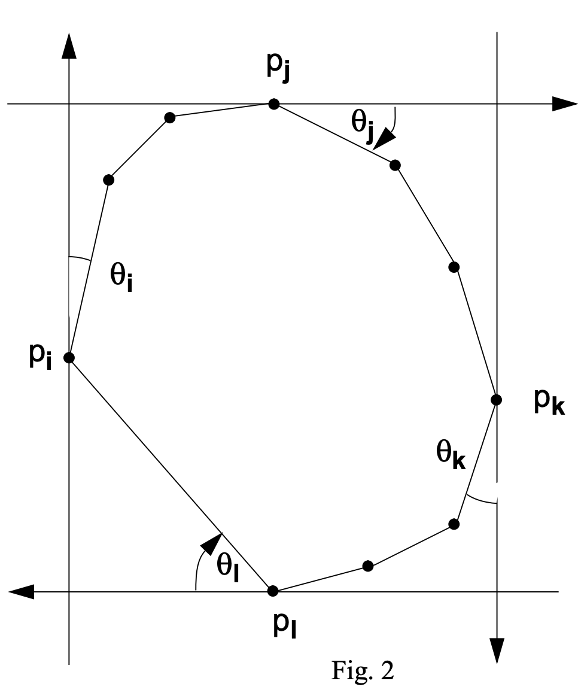

# Rotating Calipers
Computational geometry project for CSC591 at NCSU


By Varun & Spencer

## Minimum Area Bounding Rectangle
The minimum area bounding rectangle problem is concerned with finding the smallest possible rectangle that encloses a 
point set. Rotating calipers can be employed to solve this problem in linear time. The graphic in [1] provides a concise
illustration of the algorithm.

<p align="center">
    
</p>

First, the convex hull of the point set is computed. Then two sets of "calipers" are initialized with axis-aligned 
orientation. Next, the calipers are rotated by the smallest angle to the next convex hull edge. This process is 
continued until the rectangles are rotated up to 90 degrees, then the minimum area rectangle is selected.


To execute the demo, run
```
python3 minimum_area_rectangle_demo.py
```
Click points in the rectangular drawing window and press enter to run the algorithm. The demo will display the tested 
rectangles along with their area. After rotating the calipers 90 degrees, the minimum area rectangle is selected and 
displayed.

## Citations

[1] https://web.cs.swarthmore.edu/~adanner/cs97/s08/pdf/calipers.pdf